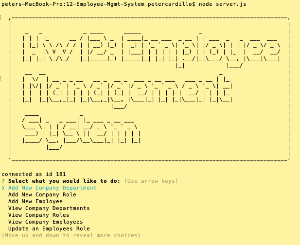
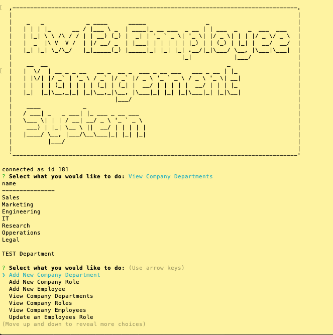
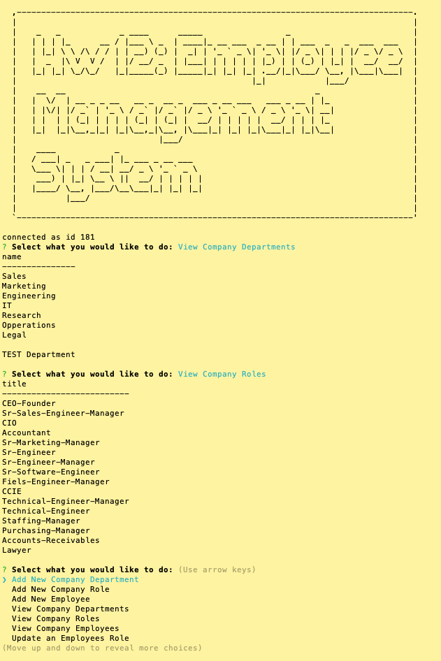
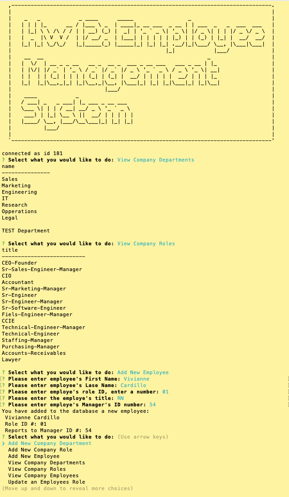
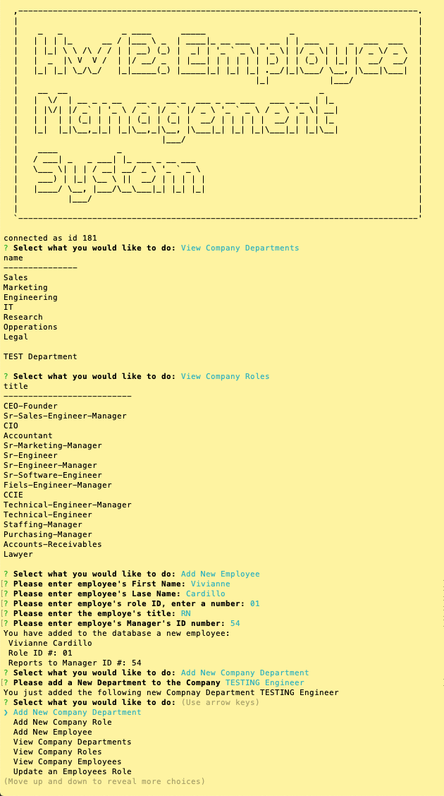
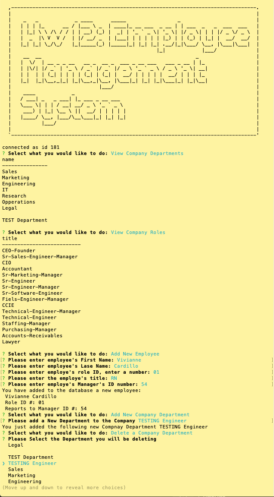
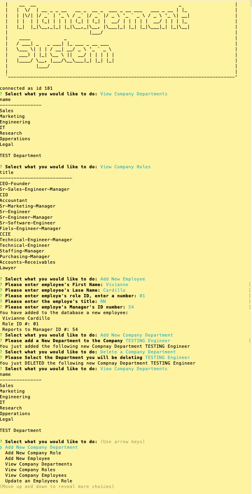
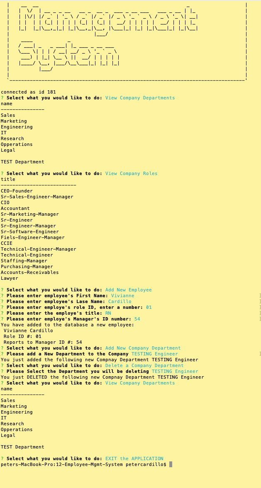

  # Project Title: HW 12 MySQL HW: Employee Tracker Database
    
  ## Table of Contents:
  - [Project Description](#project-description)
  - [Installation Instructions](#installation-instructions)
  - [Project Usage Information](#project-usage-information)
  - [Contribution Guidelines](#contribution-guidelines)
  - [Testing Instructions](#testing-instructions)
  - [License Type](#license-type)
  - [Github Repo Link](#github-repo-link)
  - [Video Demo Link Link](https://drive.google.com/file/d/1-W6xIO9kKL__tZIBBMcCMAr8LCG6Frjl/view)
  - [Github Information](#github-information)
  - [my-email-for-questions-and-information](#my-email-for-questions-and-information)

  - - -
  ## Screenshot of the App running in the terminal:
  
  - - -
  
    - - -
  
    - - -
  
    - - -
  
    - - -
  
    - - -
  
    - - -
  
    - - -

  &nbsp;
  - - -
  ## Project Description:
  - This is an application that interacts with a  small mySQL database, initially  seeded with employee's information.  Using the command line application, you can View, Add and Delete to the daabase at the command prompt.

  &nbsp;
  - - -
  ## Installation Instructions:
  - To install the application, please run npm for the following packages: inquirer, mysql, asciiart-logo, console.table and dotenv.

  &nbsp;
  - - -
  ## Project Usage Information:
  - This app is to be used to demonstrate user interactivity with a mysql database.  

  &nbsp;
  - - -
  ## Contribution Guidelines:
  - I made this, PAC with Streaming Turtles, LLC

  &nbsp;
  - - -
  ## Testing Instructions:
  - To test, please start the application at the command line by running >node server.js.  You will be presented with an opening large text ASCII Title, followed by a series of questions that will begin your interaction with and employee database.  There is a test connection for the database that is shown, acknowledging that you have connected to the database.  It will be shown directly under the ASCII Title as "connected as id: "

  &nbsp;
  - - -
  ## License Type:
  - 

  &nbsp;
  - - -
  ## gitHub Repo Link:
  - https://github.com/streamingTurtles/12-Employee-Mgmt-System

  &nbsp;
  - - -
  ## Video Demo Link:
  - https://drive.google.com/file/d/1-W6xIO9kKL__tZIBBMcCMAr8LCG6Frjl/view

  &nbsp;
  - - -
  ## Github Information:

  
- user name: streamingturtles
- [GitHub Profile](https://github.com/streamingTurtles)

  ## my-email-for-questions-and-information:
  - pcardillo@streamingTurtles.com  

  &nbsp;
- - -
- - -
Peter Cardillo, Columbia Engineering Fullstack Bootcamp, 2020-2021  
